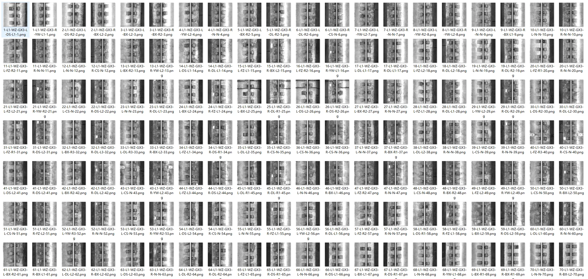
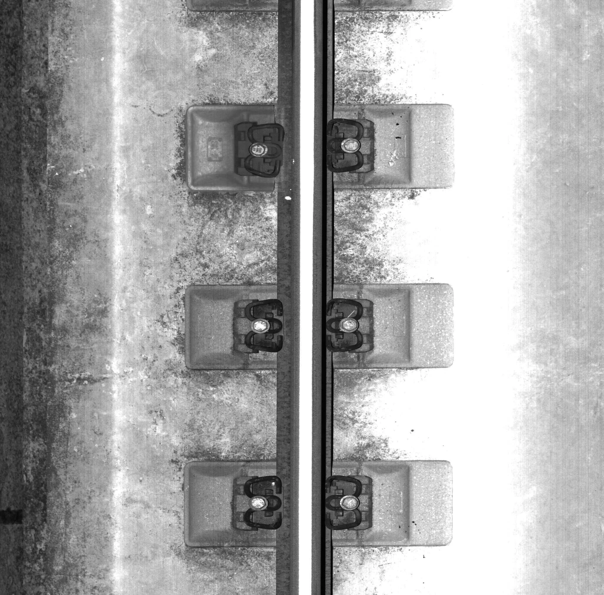
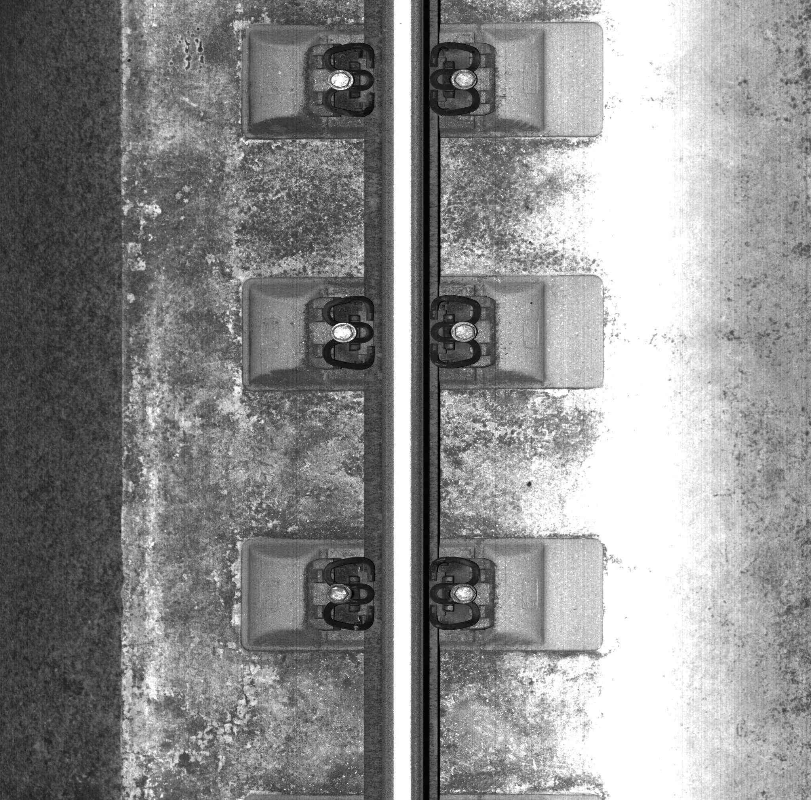
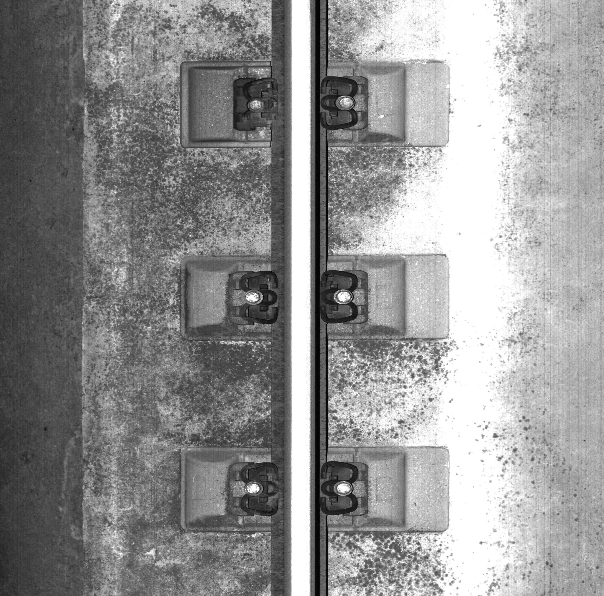
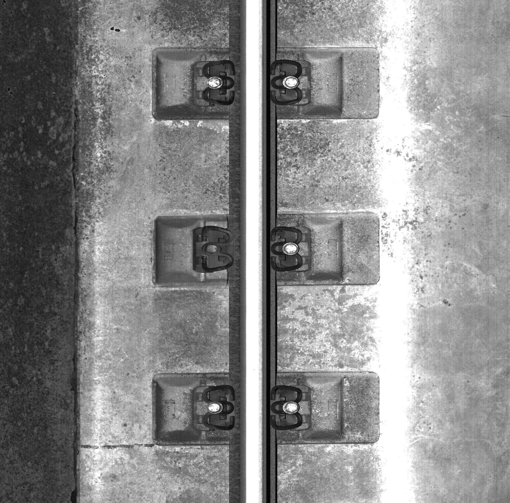

## Body

High-definition track fastener damage detection dataset in YOLO format

A metrologically high-precision benchmark dataset for fastener detection on high-speed rail, collected from a total of 1350 panoramic large images captured by a high-speed rail inspection vehicle. Unlike conventional cropped datasets, this dataset fully preserves the overall arrangement structure of the fasteners.

Training set (1250 images) Test set (100 images)

Based on engineering maintenance tolerance classification, there are six categories of samples: normal, missing, upside down, displacement, deformation, and broken, eliminating subjective visual labeling;

Relying on six visual standards including geometric, optical, gradient, noise, texture, and occlusion to control data quality, accompanied by precise instance-level semantic annotation, it can be adapted to multiple algorithm tasks such as object detection, localization, and image segmentation.

Including data source

Electronic virtual products sold without return or exchange.

## Images

Here is a pay link on Stripe ( https://buy.stripe.com/3cs8yP7sY87d0vu9AB ). Please contact me lonlonago@foxmail.com after funding $89, and I will send you a complete data files , thank you!

